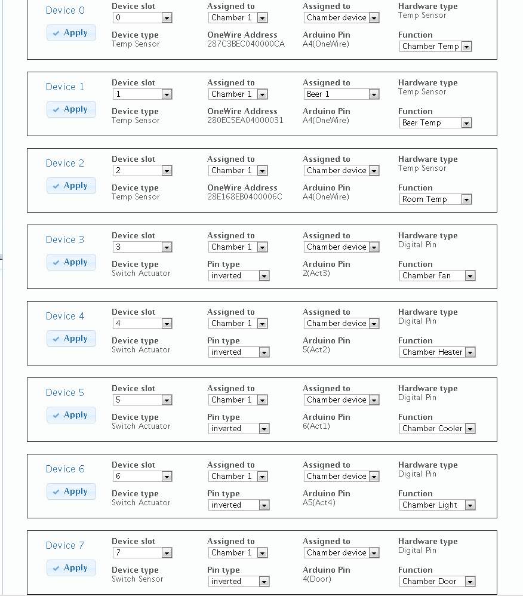

Configuring your devices
========================

Since BrewPi 0.2, the hardware setup is dynamic and flexible: you can install and uninstall hardware from the web interface. This is all done from the `Device Configuration` tab in the web interface. From the device manager you can assign hardware (temp sensors, SSRs, etc.) to functions.

The current implementation of the device manager is a bit complicated and basic, but we are working on a more user friendly interface. I hope that this document will help you set it up.

Your devices just after programming
-----------------------------------
If you have just uploaded a HEX file to your Arduino and the EEPROM was reset, it will depend on your shield version which devices are already installed.

RevC shields
^^^^^^^^^^^^
For RevC shields no devices are installed by default.

RevA shields
^^^^^^^^^^^^^
For RevA shields your devices are set up just like they were in version 0.1 for backwards compatibility. A heater, cooler and door switch are already installed. Also, 2 temperature sensors are installed as 'First device on bus'. You will notice that the 2 temperature sensors are also listed under `Detected devices`, based on their address.

If you would like to switch from 'First device on bus' to address based assignment, remove the 2 installed temperature sensors by setting their function to `None` and clicking apply. After that you can install the detected sensors based on their address. A RevA shield has two OneWire ports. You can connect multiple sensors to both if you use address based sensors.

Receiving the device list
-------------------------
Click `Refresh device list` to receive an updated list of installed and detected devices from the Arduino. To be able to receive the device list, the BrewPi script has to be running.

Installed Devices
^^^^^^^^^^^^^^^^^
All devices that are assigned to a function are found under `Installed devices`.

Detected Devices
^^^^^^^^^^^^^^^^
The detected devices list shows all devices that are automatically discovered by BrewPi, these include:
 * All OneWire devices (temperature sensors and DS2413 OneWire switches)
 * All pins for which there is a terminal on your shield

Device properties
^^^^^^^^^^^^^^^^^
Each device has the following properties:

+-------------------------------+---------------------------------------------------------------------------------------------------+
| Device setting/property       | What it does                                                                                      |
+===============================+===================================================================================================+
| Device slot                   | | A device is installed into a device slot. This is a unique number used to identify the device.  |
|                               | | When configuring your devices, make sure there are no 2 devices with the same slot.             |
+-------------------------------+---------------------------------------------------------------------------------------------------+
| Assigned to (chamber)         | | Each device is assigned to a Chamber. Currently there is only Chamber 1, but we are preparing   |
|                               | | for future multi-chamber support. Select `Chamber 1` for all your devices.                      |
+-------------------------------+---------------------------------------------------------------------------------------------------+
| Assigned to (beer)            | | In each chamber, each device is either a `Chamber device` or assigned to a beer. Currently all  |
|                               | | support devices are chamber devices, except for the beer temperature sensor which should be     |
|                               | | assigned to `Beer 1`                                                                            |
+-------------------------------+---------------------------------------------------------------------------------------------------+
| Function                      | | This is the most important setting for your device. Here you can set what the device should do. |
|                               | | The function list is automatically limited to functions that fit with the hardware type.        |
|                               | | Currently supported functions:                                                                  |
|                               | | * **Chamber temp**: the sensor in the fridge (chamber device).                                  |
|                               | | * **Beer temp**: the sensor in your beer (beer device).                                         |
|                               | | * **Room temp**: measures any temperature you want, but is not used in the algorithm, just for  |
|                               | | logging. (chamber device)                                                                       |
|                               | | * **Chamber cooler**: The output that controls your fridge compressor (chamber device)          |
|                               | | * **Chamber heater**: The output that controls your heater (chamber device)                     |
|                               | | * **Chamber light**: This output is activated when the door is opened (see chamber door) and    |
|                               | | can also be used as heater by enabling `light as heater` in advanced settings                   |
|                               | | * **Chamber door**: an input that detects when the fridge door is opened.                       |
+-------------------------------+---------------------------------------------------------------------------------------------------+
| Device type                   | | Not user configurable, set automatically based on assigned function.                            |
+-------------------------------+---------------------------------------------------------------------------------------------------+
| Hardware type                 | | Not user configurable, set automatically. (`Temp Sensor`, `Digital pin` or `OneWire actuator`)  |
+-------------------------------+---------------------------------------------------------------------------------------------------+
| Device type                   | | Not user configurable, set automatically based on assigned function.                            |
+-------------------------------+---------------------------------------------------------------------------------------------------+
| Pin type                      | | Here you can set whether the output/input should be inverted. Because the shields have a        |
|                               | | transistor that inverts the signal behind each output with a terminal, you should set this to   |
|                               | | `inverted`. For devices you add yourself, without a transistor, do not invert the signal.       |
|                               | | For the door switch, it depends on the type of switch you have.                                 |
+-------------------------------+---------------------------------------------------------------------------------------------------+
| Arduino Pin                   | | The pin the device is configured for. You can only set this yourself when defining a new device.|
|                               | | The OneWire pins are hardcoded, you can not add your own OneWire pins. Just connect your sensors|
|                               | | sensors to an existing OneWire pin and refresh the device list to detect it.                    |
+-------------------------------+---------------------------------------------------------------------------------------------------+

Installing new devices and assigning them to a function
-------------------------------------------------------
You can install a device by changing the properties to a correct configuration and hitting `Apply`. If the values are accepted by the Arduino, your device will show up under `Installed Devices` after refreshing the list.

Please refer to the screenshot below for a reference configuration with all devices installed currently supported by BrewPi. Just leave out any devices you don't have.

Uninstalling a device
---------------------
To uninstall a device, just set it's function to `None`, hit `Apply` and refresh your device list.

Done!
^^^^^
That was the last step of 'Getting started with Brewpi'! Enjoy using your BrewPi and don't forget to come and have a chat in the `BrewPi IRC channel <http://webchat.freenode.net/?channels=brewpi>`_!
